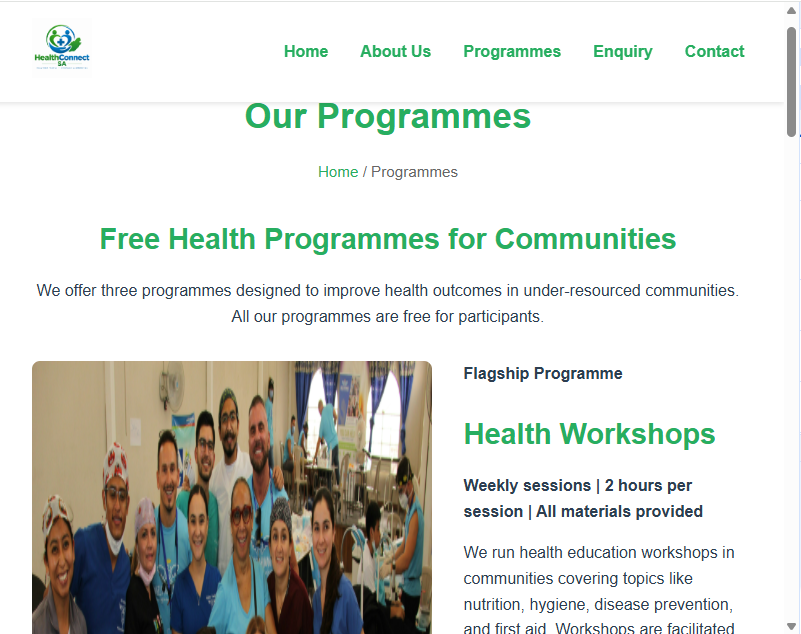
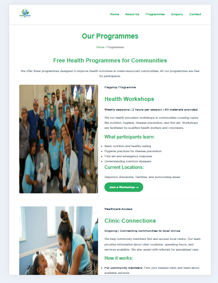
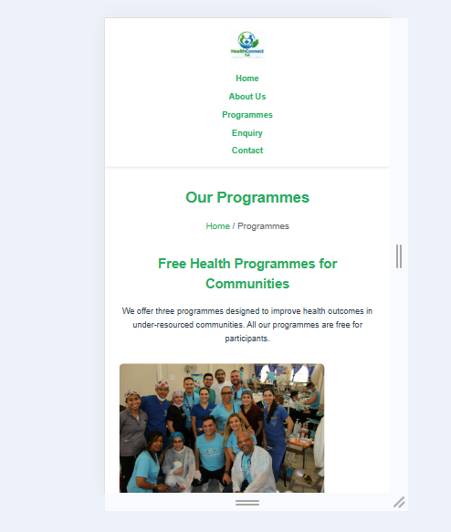
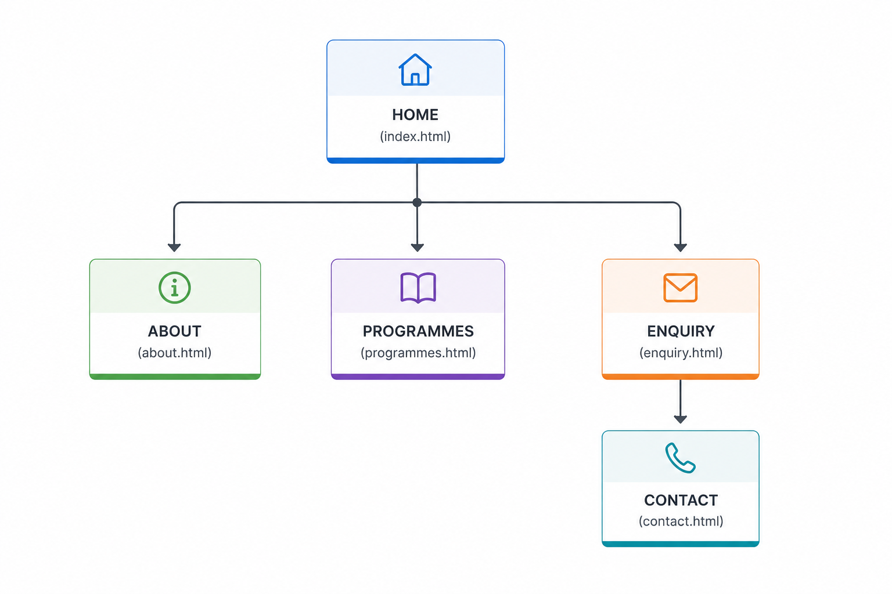

# HealthConnect SA Website

## Student Information
- **Name:** Mashilo Tshephang Masekoa
- **Student Number:** ST10472191
- **Module:** WEDE5020 - Web Development (Introduction)
- **Assessment:** POE Part 1 and Part 2
- **Date:** 10 September 2026

## Project Overview
HealthConnect SA is a fictional non-profit organisation that provides health education and connects rural communities to local clinics in South Africa. The organisation runs health workshops, clinic connections, and youth health programmes aimed at improving community health outcomes.

## Important Note on Proposal Change
During Part 1, two proposals were submitted for approval:
- **Proposal 1:** BookWise SA (literacy NPO)
- **Proposal 2:** HealthConnect SA (community health NPO)

The lecturer approved **Proposal 2: HealthConnect SA**. All subsequent work (Part 1 final submission, Part 2, and Part 3) is based on HealthConnect SA as instructed.

## Website Goals and Objectives
- Provide reliable health information to rural communities
- Recruit volunteers for community health education
- Connect people to local clinics and health services
- Attract corporate sponsors and donors

**KPIs:**
- 800 unique website visitors per month
- 30 volunteer sign-ups via enquiry form
- 50 clinic enquiries through contact form
- 5 corporate sponsorship enquiries

## Key Features and Functionality
- 5-page responsive website
- Homepage with impact stats and call-to-action
- About Us with team, mission, and vision
- Programmes page detailing three initiatives
- Enquiry form for volunteers and clinic partnerships
- Contact page with office address, location, and contact form
- Functional navigation menu on all pages

## Timeline and Milestones
- Part 1 (Week 3): Complete HTML structure, 5 pages, navigation
- Part 2 (Week 6): CSS styling, responsive design
- Part 3 (Week 9): JavaScript validation, SEO, deployment

## Part 1 Details
- 5 HTML pages: index, about, programmes, enquiry, contact
- Semantic HTML5: header, nav, main, section, footer
- Functional navigation menu on all pages
- Image placeholders for all images
- Two forms: enquiry (volunteer/clinic partnership) and contact

## Part 2 Details - CSS Styling and Responsive Design

### CSS Features Implemented
- External stylesheet (style.css) linked to all 5 pages
- CSS reset for consistent cross-browser styling
- Typography: Raleway for headings, Roboto for body text
- Colour scheme: #27AE60 (green) and #2980B9 (blue)
- Layout: Flexbox for stats, cards, forms, and footer
- Pseudo-classes: :hover and :focus effects on buttons, links, and form inputs
- Responsive breakpoints at 768px (tablet) and 480px (mobile)

### Responsive Design Evidence

#### Desktop View (1200px+)

#### Tablet View (768px)

#### Mobile View (480px)

### How the Website Adapts
| Device | Layout Changes |
|--------|----------------|
| Desktop | Horizontal navigation, cards in a row, stats in a row, two forms side by side |
| Tablet | Stacked layout, vertical navigation, larger touch targets |
| Mobile | Single column, full-width buttons, smaller text |

## Sitemap

### Visual Sitemap

### Sitemap Explanation
The website consists of 5 pages arranged in a flat hierarchy:

1. **Homepage (index.html)** – Entry point with hero section, impact statistics, programme preview cards, and call-to-action. All other pages are accessible from the navigation menu.

2. **About Us (about.html)** – Background information including organisation history, mission statement, vision statement, four core values, and three team member profiles.

3. **Programmes (programmes.html)** – Details three core programmes: Health Workshops, Clinic Connections, and Youth Health Programme. Each includes a description, key features, and a call-to-action button.

4. **Enquiry (enquiry.html)** – Contains two forms side by side: Volunteer Application and Clinic Partnership. Also includes a "Why Get Involved" section with four benefit boxes.

5. **Contact (contact.html)** – Displays office address, phone numbers, email addresses, office hours, and a contact form. Includes location map placeholder.

**Navigation:** All pages are linked through the navigation menu in the header and footer.

## Changelog

### 2026-09-06 – Project setup
- Created main project folder: HealthConnectSA-Website
- Created subfolders: css/, js/, images/
- Created README.md with student information and project overview
- Noted switch from Proposal 1 (BookWise SA) to Proposal 2 (HealthConnect SA) as per lecturer approval

### 2026-09-07 – Added homepage
- Added index.html with hero section and call-to-action buttons
- Added impact statistics section (5,000+ people, 15 clinics, 50+ volunteers, 120 workshops)
- Added programme preview cards for three initiatives
- Added footer with social media links

### 2026-09-08 – Added About Us and Programmes pages
- Added about.html with organisation history, mission, vision, values, and team profiles
- Added programmes.html with Health Workshops, Clinic Connections, and Youth Health Programme
- Added bullet points for each programme's key features
- Added call-to-action buttons linking to enquiry page

### 2026-09-09 – Added Enquiry and Contact pages
- Added enquiry.html with volunteer application form
- Added enquiry.html with clinic partnership form
- Added contact.html with address, phone numbers, and email addresses
- Added location section with map placeholder
- Added contact form with name, email, subject, and message fields
- Added "Why Get Involved" section with four benefit boxes

### 2026-09-10 – Added navigation and comments
- Added navigation menu to all 5 pages
- Ensured all navigation links work correctly
- Added descriptive HTML comments before each major section
- Properly indented all HTML code for readability
- Completed Part 1 README with sitemap explanation and references

### 2026-09-11 – Part 2: CSS Styling and Responsive Design
- Created external style.css with CSS reset and base styles
- Added typography (Raleway headings, Roboto body)
- Implemented layout using Flexbox for stats, cards, and forms
- Added colour scheme (#27AE60 green, #2980B9 blue)
- Added pseudo-classes (:hover, :focus) for buttons, links, and form inputs
- Added responsive media queries for tablet (768px) and mobile (480px)
- Adjusted layout, typography, navigation, and images for all breakpoints
- Added screenshot evidence of responsive design to README
- Linked CSS to all 5 HTML pages

### 2026-09-13 Pushing on GitHub repository
- Uploaded project files on repository
- Uploaded project folders on repository
- Made commits

## References

### Part 1 References
Department of Health, 2024. *Community health outreach report*. [pdf] Pretoria: DoH. Available at: <https://www.health.gov.za/community-report> [Accessed 6 September 2026].

World Health Organization, 2024. *Health literacy and community engagement*. [online] Available at: <https://www.who.int/health-literacy> [Accessed 6 September 2026].

Unsplash, 2026. *Community health workers*. [image] Available at: <https://unsplash.com/photos/community-health> [Accessed 6 September 2026].

Figma, 2026. *Figma: Collaborative Design and Prototyping Tool*. [online] Available at: <https://www.figma.com/> [Accessed 7 September 2026].

### Part 2 References
Google Fonts, 2026. *Raleway and Roboto fonts*. [online] Available at: <https://fonts.google.com> [Accessed 11 September 2026].

Mozilla Developer Network, 2026. *CSS: Cascading Style Sheets*. [online] Available at: <https://developer.mozilla.org/en-US/docs/Web/CSS> [Accessed 11 September 2026].

W3Schools, 2026. *CSS Tutorial*. [online] Available at: <https://www.w3schools.com/css/> [Accessed 11 September 2026].

GeeksforGeeks, 2026. *CSS Flexbox*. [online] Available at: <https://www.geeksforgeeks.org/css-flexbox/> [Accessed 11 September 2026].